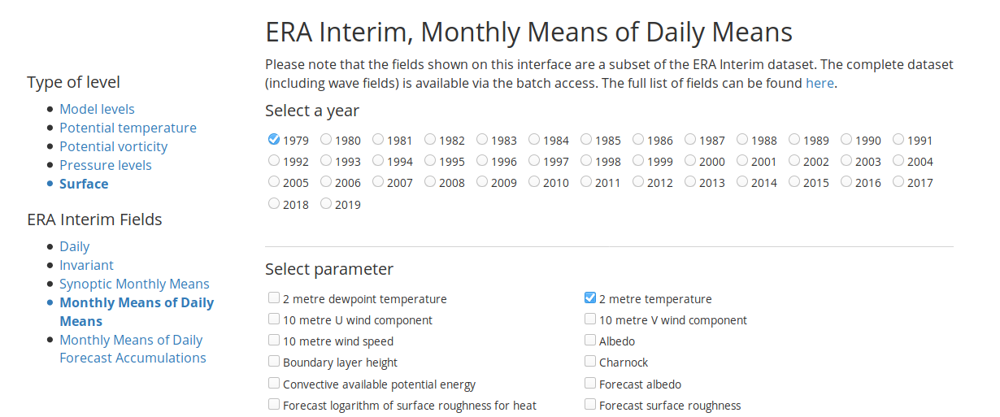
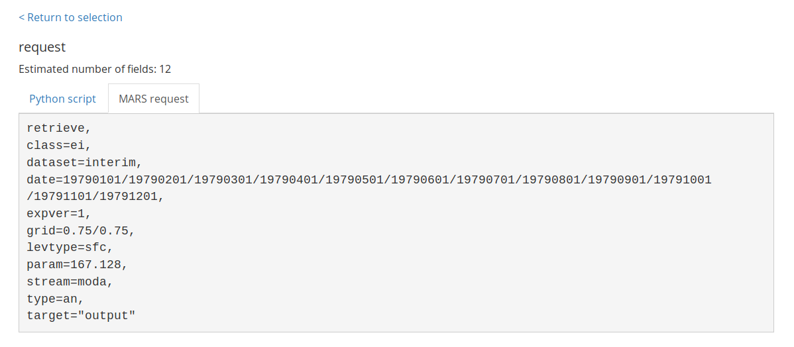

  
```{r setup, include = FALSE}
knitr::opts_chunk$set(
collapse = TRUE,
comment = "#>"
)
```

I was born on august 1988, who has the surface temperature of the planet changed from then?

First,  you need to save your personal API key. `wf_set_key()` will take you to the correct URL where you can get your key (you will have to register if you're not already.) This needs to be run only once in each machine. 

```{r eval=FALSE}
library(ecmwfr)

wf_set_key(service = "webapi")
```

```{r, echo = FALSE}
library(ecmwfr)
```


Now you need to build a request to the ECMWF WebAPI. It's a rather complex process, so the easiest way to do it is to go [to the website](https://apps.ecmwf.int/datasets/) and use the point and click interface to create a basic request that you then will change slightly. In this case, we will use data from [ERA Interim](https://apps.ecmwf.int/datasets/data/interim-full-daily/levtype=sfc/). 



At the bottom of the page, now you need to click the "View the MARS request" button. Now we get access to a valid MARS request that we can modify. 



Whith this template, we can create a list (if you use RStudio the "MARS to list" addin will do this for you automatically). This would be the MARS request translated to a list. We've added `format  = "netcdf"` at the end. 

```{r}
ERAI_monthly <- list(
  class   = "ei",
  dataset = "interim",
  date    = "19790101/19790201/19790301/19790401/19790501/19790601/19790701/19790801/19790901/19791001/19791101/19791201",
  expver  = "1",
  grid    = "0.75/0.75",
  levtype = "sfc",
  param   = "167.128",
  stream  = "moda",
  type    = "an",
  target  = "output",
  format  = "netcdf"
)
```

With this base request, we can now change the `date` and `grid` fields to construct new requests. As you can see, the MARS format for dates can be rather long to type, so now we'll create a custom function to make this easier:

```{r}
format_dates <- function(dates) {
  paste0(lubridate::year(dates),
         formatC(lubridate::month(dates), width = 2, flag = "0"),
         formatC(lubridate::day(dates), width = 2, flag = "0"),
         collapse = "/")
}
```

Now we are ready to download data! We're interested in temperature for the month of August between 1988 and 2018, so we'll create the request using these dates.

```{r}
dates <- seq.Date(as.Date("1988-08-01"), as.Date("2018-08-01"), "1 year")

my_request <- wf_modify_request(ERAI_monthly, 
                                date = format_dates(dates), 
                                grid = "3/3",
                                target = "august_monthly.nc")
str(my_request)
```

And now use `wf_request()` to download the data. This will take some time. 

```{r}
wf_request(request = my_request, 
           user = "eliocampitelli@gmail.com", 
           transfer = TRUE,
           path = ".", verbose = FALSE)
```

Now that we have our data saved as "august_monthly.nc", we need to load it and analyse it. We'll use the metR package for that. 

```{r}
library(metR)
library(ggplot2)
library(data.table)
```

```{r}
august_temp <- ReadNetCDF("august_monthly.nc")
```

First a quick look at the data. 

```{r}
str(august_temp)
```

It's a data frame with a value of `t2m` for each longitude, latitude and time. The temperature is in Kelvin. Let's take a look at one field.

```{r}
august_temp[, t2m := t2m - 273.15]  # convert to degree celcius

world <- geom_path(data = map_data("world2"), 
                   aes(long, lat, group = group), 
                   size = 0.2, color = "gray50")

ggplot(august_temp[time == time[1]], aes(longitude, latitude)) +
  geom_contour_fill(aes(z = t2m)) +
  world +
  scale_fill_divergent("2m temperature (°C)")
```

The tropis are warmer than the poles, as it should be. 

Now that we understand the data, let's compute the linear trend of temperature at each gridpoint. We'll use a **very crude** method to get the statistical signficance of the trend. 

```{r}
trends <- august_temp[, FitLm(year = year(time), t2m, se = TRUE), 
                      by = .(longitude, latitude)] 
trends[, p.value :=  pt(abs(estimate)/std.error, df, lower.tail = FALSE)]

ggplot(trends[term == "year"], aes(longitude, latitude)) +
  geom_contour_fill(aes(z = estimate*10)) +
  stat_subset(aes(subset = p.value <= 0.01), 
              geom = "point", size = 0.1, alpha = 0.5) +
  world +
  scale_fill_divergent("2m temperature \ntrend (°C/decade)")
```

Not surprisingly, the trend is positive almost everywhere, although not everywhere statistically significant using this **very crude** method. 

We can construct a **crude** global mean temperature (GMT) timeseries by averaging all gridpoint for each year. Weighting with the cosine of latitude is important. 

```{r}
gmt <- august_temp[, .(t2m = weighted.mean(t2m, cos(latitude*pi/180))), 
                   by = year(time)]

ggplot(gmt, aes(year, t2m)) +
  geom_line() +
  geom_smooth(method = "lm") +
  scale_y_continuous("2m temperature (°C)")
```

Again, not surprisingly, global temperature is going up. Let's compute the rate of increase 

```{r}
trend <- lm(t2m ~ year, data = gmt)
summary(trend)
```

The rate of `r round(coef(trend)[2]*10, 2)` °C/decade is consistent with estimates using better methods. 

